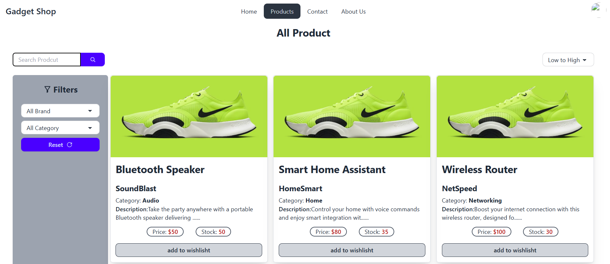

# Gadget Shop

This is a modern, responsive e-commerce web application for a gadget shop, built with React and Tailwind CSS. It provides a seamless shopping experience for users, with features like product browsing, searching, filtering, and a fully functional shopping cart.

## Key Features

### Advanced Product Search

Our powerful search functionality allows users to easily find the products they're looking for. You can search by name, category, or any other product attribute.


<!--  -->


## 🎥 Watch Demo Video

[](https://www.loom.com/share/7cf5d7cb91f042bcba1b6f513592d3e9)


<!-- [🎥 Watch Demo Video](./src/assets/video/Gadget%20Shop%20Searching%20Feature%20.mp4) -->


*You can show video by clicking this image. Its redirect to thia video page on loom website*

## Live Demo

[Link to Live Demo](https://your-live-demo-link.com)

## Features

- **Responsive Design:** Works on all devices.
- **Product Management:** Add, edit, and delete products.
- **User Authentication:** Secure user registration and login.
- **Product Filtering and Sorting:** Filter and sort products by various attributes.
- **Shopping Cart:** A fully functional shopping cart.
- **Dashboard:** A comprehensive dashboard for administrators.

## Technologies Used

- **React:** A JavaScript library for building user interfaces.
- **React Router:** A routing library for React applications.
- **Tailwind CSS:** A utility-first CSS framework for rapid UI development.
- **Vite:** A fast build tool for modern web projects.
- **ESLint:** A pluggable and configurable linter tool for identifying and reporting on patterns in JavaScript.

## Code Link

Your Name - sunnycse03@gmail.com

Project Client code Link: [https://github.com/ahsunny/gadget-shop-clint](https://github.com/ah-sunny/gadget-shop-clint) 
<br>
Project server code Link: [https://github.com/ahsunny/gadget-shop-clint](https://github.com/ah-sunny/gadget-shop-clint)


## Getting Started

To get a local copy up and running, follow these simple steps.

### Prerequisites

- Node.js (v14 or later)
- npm (v6 or later)

### Installation

1. Clone the repo
   ```sh
   git clone https://github.com/your_username/gadget-shop-clint.git
   ```
2. Install NPM packages
   ```sh
   npm install
   ```

### Usage

To start the development server, run the following command:

```sh
npm run dev
```

This will start the development server at `http://localhost:5173`.

## Available Scripts

In the project directory, you can run:

- `npm run dev`: Runs the app in the development mode.
- `npm run build`: Builds the app for production to the `dist` folder.
- `npm run lint`: Lints the code using ESLint.
- `npm run preview`: Serves the production build locally for preview.

## 👤 Author

**Arafat Sunny**  
B.Sc in CSE, National Institute of Textile Engineering and Research (NITER)  
MERN Stack Developer <br/>
| [LinkedIn](https://www.linkedin.com/in/-sunny) | [GitHub](https://github.com/ah-sunny) |